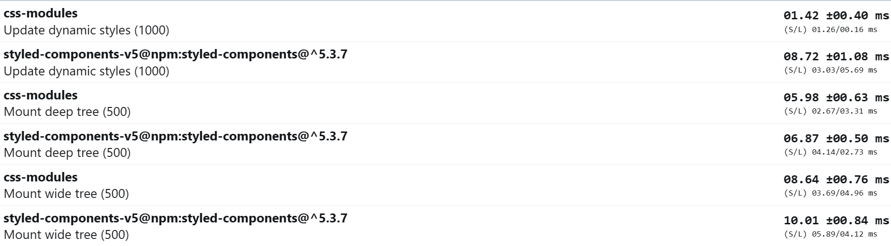

# CSS-in-JS: Is a Bad Idea?

This article assumes you are familiar with various styling methods.

### Problems CSS-in-JS aims to solve:

- Scoped styles
- Dynamic styles
- Collocation of styles and components

### How css in js works under the hood:

- **Parsing styles**: Convert styles from JavaScript objects or tagged template literals into CSS format.
- **Generating unique class names**: Create a unique hash-based class name for each set of styles to scope them to specific components.
- **Handling dynamic styles**: Update styles based on component props or state changes, generate new class names if necessary, and inject the updated styles into the DOM.
- **Injecting styles into the DOM**: Create a `<style>` element, append it to the `<head>`, and update its content with the generated CSS.
- **Managing the CSS cache**: Maintain a cache of generated styles to improve performance and prevent unnecessary re-rendering.
- **Server-side rendering**: Extract generated styles on the server and include them in the initial HTML payload.

```js
// Simplified CSS-in-JS implementation
function parseStyles(styles) {...}
function generateClassName(styles) {...}
function injectStyles(css) {...}
function updateDynamicStyles(component) {...}

const styles = {color: "red", fontSize: "14px"};
const css = parseStyles(styles);
const className = generateClassName(styles);
injectStyles(css);
element.className = className;
updateDynamicStyles(component);
```

## Why `styled` hoc abstraction is a mess

Basicly it provides opportunity to encapsulate styles with HTML element

```ts
const Button = styled.button`
  /* ... */
`;
```

However, this limits style reusability across elements. Libraries use the as prop to solve this, but it creates bad abstractions and complicates TypeScript typing.

Somewhere in `styled-components` types

```ts
export interface ThemedStyledFunction<
  C extends keyof JSX.IntrinsicElements | React.ComponentType<any>,
  T extends object,
  O extends object = {},
  A extends keyof any = never
> extends ThemedStyledFunctionBase<C, T, O, A> {
  // Fun thing: 'attrs' can also provide a polymorphic 'as' prop
  // My head already hurts enough so maybe later...
  attrs<
    U,
    NewA extends Partial<StyledComponentPropsWithRef<C> & U> & {
      [others: string]: any;
    } = {}
  >(
    attrs: Attrs<StyledComponentPropsWithRef<C> & U, NewA, T>
  ): ThemedStyledFunction<C, T, O & NewA, A | keyof NewA>;
  // ...
}
```

Btw we can just use classes and not suffer how to determine what the component HTML element or try to change it.

```tsx
<Button as="a" />;
// vs
<>
  <button className={styles.button} />
  {/* WOW: its revolution, classes will be next hype in frontend development */}
  <button className={clsx(styles.button, styles.hoverable)} />
  <a className={styles.button} />
</>;
```

### Issues with CSS-in-JS:

- Overhead due to runtime transformation
- Slower render phase
- Additional CSS parser burden on the browser
- Repeated CSS parsing and injection on value changes
- Performance issues with template literals

### Measuring Performance Overhead:

You can experiment with [benchmark playground](https://xantregodlike.github.io/article-css-in-js/)
Original benchmark from styled-components repo:


Modified benchmark with borderBottomColor moved from inline styles to styled:

<details>
<summary>Fixed benchmark</summary>



</details>

| Benchmark          | Overhead of CSS in JS (styled-components) |
| ------------------ | ----------------------------------------- |
| Mounting deep tree | 20%                                       |
| Mounting wide tree | 13.1%                                     |
| Updating dynamic   | 589.1%                                    |
| Updating static    | 168.8%                                    |

Performance of styled-components decreases by 4 times when borderBottomColor is moved from inline styles to styled.

### Solutions:

- Keep style templates mostly static
- Use selectors and variables for dynamic features
- Migrate to build-time CSS-in-JS libraries like Linaria
- For new projects, consider utility CSS approach (Tailwind)

### Benefits of Utility CSS Approach (Tailwind):

- JIT compilation of classes for build-time dynamic classes
- Faster performance
- Transparent, zero-abstraction styling
- Easy setup in any environment
- Less code and adaptive abstractions
