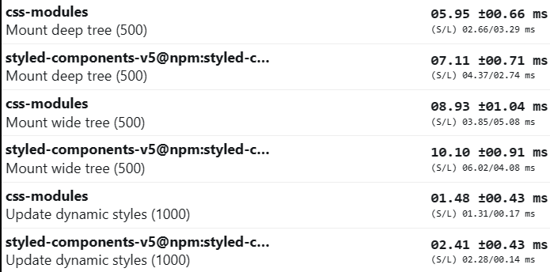

## CSS-in-JS: Is a Bad Idea?

This article assumes you are familiar with various styling methods.

### Problems CSS-in-JS aims to solve:

- Scoped styles: Ensuring styles don't leak to other components unintentionally.
- Dynamic styles: Adapting styles based on props, state, or other dynamic data.
- Collocation: Keeping styles and components together for maintainability.

### Unraveling CSS-in-JS:

- **Parsing styles**: Convert styles from JavaScript objects or tagged template literals into CSS format.
- **Generating unique class names**: Create a unique hash-based class name for each set of styles to scope them to specific components.
- **Handling dynamic styles**: Update styles based on component props or state changes, generate new class names if necessary, and inject the updated styles into the DOM.
- **Injecting styles into the DOM**: Create a `<style>` element, append it to the `<head>`, and update its content with the generated CSS. _after each injection browser makes style recalculation_
- **Managing the CSS cache**: Maintain a cache of generated styles to improve performance and prevent unnecessary re-rendering.
- **Server-side rendering**: Extract generated styles on the server and include them in the initial HTML payload.

```js
// Simplified CSS-in-JS implementation
function parseStyles(styles) {...}
function generateClassName(styles) {...}
function injectStyles(css) {...}
function updateDynamicStyles(component) {...}

const styles = {color: "red", fontSize: "14px"};
const css = parseStyles(styles);
const className = generateClassName(styles);
injectStyles(css);
element.className = className;
updateDynamicStyles(component);
```

## Why `styled` hoc abstraction is a mess

Basicly it provides opportunity to encapsulate styles with HTML element

```ts
const Button = styled.button`
  /* ... */
`;
```

However, this limits style reusability across elements. 
Libraries use the `as` prop to solve this, but it creates bad abstractions and complicates TypeScript typing.

Somewhere in `styled-components` types

```ts
export interface ThemedStyledFunction<
  C extends keyof JSX.IntrinsicElements | React.ComponentType<any>,
  T extends object,
  O extends object = {},
  A extends keyof any = never
> extends ThemedStyledFunctionBase<C, T, O, A> {
  // Fun thing: 'attrs' can also provide a polymorphic 'as' prop
  // My head already hurts enough so maybe later...
  attrs<
    U,
    NewA extends Partial<StyledComponentPropsWithRef<C> & U> & {
      [others: string]: any;
    } = {}
  >(
    attrs: Attrs<StyledComponentPropsWithRef<C> & U, NewA, T>
  ): ThemedStyledFunction<C, T, O & NewA, A | keyof NewA>;
  // ...
}
```

Btw, we could simply use classes, avoiding the hassle of identifying or altering component HTML elements.

```tsx
<Button as="a" />;
// vs
<>
  <button className={styles.button} />
  {/* WOW: its revolution, classes will be next hype in frontend development */}
  <button className={clsx(styles.button, styles.hoverable)} />
  <a className={styles.button} />
</>;
```

### Issues with CSS-in-JS:

- Overhead due to runtime transformation
- Sluggish render phase compared to traditional CSS
- Additional CSS parser burden on the browser
- Repeated CSS parsing and injection on value changes

### Measuring Performance Overhead:

This benchmark was used in `styled-components` repo for performance overview 
([original repo](https://github.com/styled-components/styled-components/tree/main/packages/benchmarks)).
But it was't fail enough because, styled-components used inline styles for dynamic styles, that can't tell
anything about performance
<details>
<summary>How i fixed this issue</summary>

Initial version:
```tsx
const Dot = styled(View).attrs((p) => ({
  style: { borderBottomColor: p.color },
}))`
  position: absolute;
  cursor: pointer;
  width: 0;
  height: 0;
  border-color: transparent;
  border-style: solid;
  border-top-width: 0;
  transform: translate(50%, 50%);
  margin-left: ${(props) => `${props.x}px`};
  margin-top: ${(props) => `${props.y}px`};
  border-right-width: ${(props) => `${props.size / 2}px`};
  border-bottom-width: ${(props) => `${props.size / 2}px`};
  border-left-width: ${(props) => `${props.size / 2}px`};
`;
```

So i just replaced inline styles with `styled`

```tsx
const Dot = styled(View)`
  /* ... */
  border-bottom-color: ${(props) => props.color};
  /* ... */
`;
```


</details>

Benchmark results:


You can experiment with benchmark playground: [here](https://xantregodlike.github.io/article-css-in-js/).
[source code](https://github.com/XantreGodlike/article-css-in-js/tree/main/styled-components/packages/benchmarks)
<details>
<summary>Fixed benchmark results:</summary>


</details>

| Benchmark          | Overhead of CSS in JS (styled-components) |
| ------------------ | ----------------------------------------- |
| Mounting deep tree | 20%                                       |
| Mounting wide tree | 13.1%                                     |
| Updating dynamic   | 589.1%                                    |
| Updating static    | 168.8%                                    |

Performance of styled-components decreases by 4 times when borderBottomColor is moved from inline styles to styled.

### Solutions:

- Limit the dynamic nature of style templates
- Utilize selectors and variables for dynamic components
- Transition to build-time CSS-in-JS libraries, such as Linaria
- For greenfield projects, contemplate the utility CSS approach (like Tailwind)

### Benefits of Utility CSS Approach (Tailwind):

- JIT compilation of classes for build-time dynamic classes
- Faster performance
- Transparent, zero-abstraction styling
- Easy setup in any environment
- Less code and adaptive abstractions
